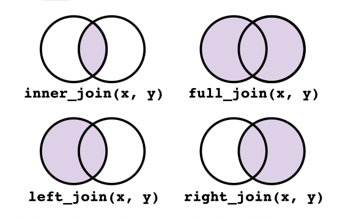

```{r setup, include=FALSE, purl=FALSE}
knitr::opts_chunk$set(echo = TRUE, comment = NA, purl = TRUE)
options(
  htmltools.dir.version = FALSE,
  htmltools.preserve.raw = FALSE
)
```

---

## About me 

.pull-left[


] 

.pull-left[

- Statistician at [NEAR](https://www.near-aging.se/), KI.
- MSc in Statistics, Uppsala University.
- Interests: 
  - R package dev
  - Statistics
  - Data manipulation
  - guitar
]


---
## `workshopr` package

### Install
```{r install package, eval=FALSE}
install.packages("remotes")
remotes::install_github("Bolin-Wu/workshopr",
  subdir = "rpackage",
  force = TRUE
)
```


### Load
```{r load package, message=FALSE}
library(workshopr)
library(tidyverse)
```

---
class: center, middle

# Data manupulation

### tidyverse, assign

---
## Introduction

This session is to share useful data manipulation skills at daily epidemiology work. My main goal is to follow the "don't repeat yourself" (DRY) principle. 

It can make our code more readable and reduce our chance of making mistakes.

--

*Note: Data frames may seem to be unfit in the slides. I do not user any html widges since the code will be pulled out for tutorial purpose. Attendants can run the code on their on machine instead to get better view.*


???

For example, change a variable name in the code, but forget to change other places

---

## Content

The content is selected based on data manipulation in real work scenario.

I hope by the end of the workshop, you will have them in your toolbox:

- %>% syntax
- **join** data frames (*join function*)
- **transform** data shape (*pivot_longer*)
- **filter** variables based on name pattern (*select*)
- **extract** the label from DTA and SPSS in R (*filter*)
- **check** missing values (*summarise & across*)
- **mutate data** based on column types (*mutate & across*)
- **bin** variables by percentiles (*cut*)
- **assign** function

---

background-image: url(https://1.bp.blogspot.com/-UHpM76ze7Dk/YFVs4iGMWuI/AAAAAAAAA0s/3EpcYcl-PLce7rcdcD4YOUXntpdUbc3aACLcBGAsYHQ/s16000/7b5f79a7e88560bb863c6bc8bcfb7146.jpg)

.footnote[picture credit: https://www.redarmy.in/]


---

# Tidyverse


Many times we just `library(tidyverse)`. Actually [Tidyverse](https://www.tidyverse.org/packages/) is a huge umbrella consists of several powerful visualization and data manipulation package. For example:

- [magrittr](https://magrittr.tidyverse.org/): pipeline operator `%>%`.
- [ggplot2](https://ggplot2.tidyverse.org/): `ggplot()`.
- [dplyr](https://dplyr.tidyverse.org/): `select(), filter(), mutate()`

--

### Notes

- Advantage: All at once.
- Disadvantage: 
  - Slower to load the whole package. 
  - Potential conflicts of function names with other packages. Example [here](https://tidyverse.tidyverse.org/reference/tidyverse_conflicts.html).

???

Just heads up, in case in the future you find one function does not work as it expected. Then you know it could because of the conflicts of tidyverse.

---

## Pipeline operator `%>%`
Beautiful syntax with pipeline, just like playing LEGO.


---

### Example

```{r}
fake_snack_df %>%
  select(Lopnr, Date_wave1)
```

---

- In addition, filter on the date column

```{r continue example}
fake_snack_df %>%
  select(Lopnr, Date_wave1) %>%
  filter(Date_wave1 > "1800-01-01") %>%
  slice(1:5)
```

--

- You can further stacking group, filter, mutate, etc., with the pipeline operator.

???
This syntax makes data manupulation convenient and easy to read.

---
## Join data frames


* With `.*_join()` function: There are 4 common types of joins.




---

- Take `left_join()` as an example: 

```{r}
# From  `dplyr` documentation:
df1 <- tibble(x = 1:3)
df2 <- tibble(
  x = c(1, 1, 2),
  y = c("first", "second", "third")
)
df1 %>% left_join(df2)
```

???
Please note, in this example, df1 is on the left side.


---
## Transform data shape
Transform data shape is frequently used to clean data. However, for many people, including me, it sounds troublesome. In R, its relevant functions are evolving overtime as well.

--

In the beginning (2019), I used [spread()](https://tidyr.tidyverse.org/reference/spread.html) and [gather()](https://tidyr.tidyverse.org/reference/gather.html).  Every time I use `spread()` and `gather()`, it takes me a while to figure out how to fill in 'key' and 'value'. But as you can see from their documentation, their 'lifecycle' is 'superseded'.

---
## Transform data shape

Now I only use `pivot_longer()` and `pivot_wider()` for transforming data. You can find their comprehensive documentation [here](https://tidyr.tidyverse.org/articles/pivot.html). 

--

They come with better documentation, more powerful application, and better integration with tidyverse syntax.

---

### Example

Let's assume we received a wide format data:

```{r check data}
head(fake_snack_df, n = 5)
```

???
Please run the code in your R studio to get a better view.
---

### Example

The column names are:

```{r check column names}
sort(colnames(fake_snack_df))
```

--

Now, assume for some reason, e.g. merge it with other data set, we want to transform it in a long format. 

--

There are two variables with prefix should be formatted: 'Date' and 'dementia'. For beginners, I would recommend to start small. 

---
### Example
- Select the interested columns

```{r start small}
fake_snack_df %>%
  select(contains("Date")) %>%
  slice(1:5)
```

---
### Example

Read documentation, try to fill in the arguments. 
```{r, eval=FALSE}
?tidyr::pivot_longer()
```

--

- The 3 basic arguments are:
  * `cols()`: tells R what variables to pivot.
  * `names_to()`:  a new name for columns in `cols()`. 
  * `values_to()`: a new name for **values** under the columns in `cols()`.

---

### Example
Let's give a first try:

  
```{r pivot date}
fake_snack_df %>%
  select(Lopnr, contains("Date")) %>%
  pivot_longer(
    cols = contains("Date"),
    names_to = "wave", values_to = "date",
    names_prefix = "Date"
  )
```


---

### Example

The result above looks good, but 'wave' looks a bit strange. I will leave the task to audience to fix this column.


--
* Do the same with 'dementia' columns

--

```{r}
fake_snack_df %>%
  select(Lopnr, contains("dementia")) %>%
  pivot_longer(
    cols = contains("dementia"),
    names_to = "wave", names_prefix = "dementia",
    values_to = "dementia"
  )
```

???
Pay attention to what arguments are changed, what are not changed.

---

### Data transform exercise (5 - 10 min)

- Read documentation. Change the arguments in the `pivot_longer()` function to get proper wave column. 

*Example result (first 5 rows):*

```{r, echo=FALSE, purl=FALSE}
# answer
fake_snack_df %>%
  select(Lopnr, contains("Date")) %>%
  pivot_longer(
    cols = contains("Date"),
    names_to = "wave", names_prefix = "Date_wave",
    values_to = "date"
  ) %>%
  mutate(wave = as.factor(wave)) %>%
  slice_head(n = 5)
```

--

- Merge the two long pivot data sets together. 

*Consider: is it enough to only join on one column? Why or why not?*

---

## Select variables by name pattern

Some times you get data with specific variables. E.g.

- Each wave has its own specific prefix.
- Questionnaire/in person test has its own prefix.
- ...

--

In this case, the `select()` function can help you. Some useful **selection helpers** are

- `starts_with()`
- `contains()`
- `matches()`
- ...

More details please see documentation:
```{r, eval=FALSE}
?select()
```

???
Explain them. 90% of the time I just use these four.

---

### starts_with

```{r, eval=FALSE}
fake_snack_df %>%
  select(starts_with("Date"))
```

### contains

```{r, eval=FALSE}
fake_snack_df %>%
  select(contains("Date") & contains("wave"))
```

--

- Imagine if only using `contains('Date')` without '&' operator. What result would look like? Then try it.

---

### match

- `match()` is more advanced since it uses [regular expression (regex)](https://en.wikipedia.org/wiki/Regular_expression). 

--

- There are many regex cheatsheets online. For exmaple [this](https://www.rexegg.com/regex-quickstart.html).

--

- One useful website to test regex is [here](https://regex101.com).

```{r, eval=FALSE}
fake_snack_df %>%
  select(matches("Date_wave\\d"))
```


???

With match basically you can filter any pattern of variable names you want.

I can show to test it in the online test website.


---

## Get labels from datasets

- When we get SPSS or STATA data sets, usually they come with labels. E.g. in SPSS, one can check them in the "Variable View" tab. 

--

- In R, one can use `view()` function. In the example data, we have:

```{r, eval=FALSE}
view(fake_snack_df)
```


--

- A natural question to ask: how to extract the labels in R?

???
This can be useful when you got hundreds of variables in a file.

There's one project has 200+ variables, I need to select the variables related to smoking.


---

If you run `str()` function, the labels are in the "label" attribute. There are multiple ways to extract the labels.

```{r, eval=FALSE}
str(fake_snack_df)
```

--

The one I use is the [sjlabelled](https://strengejacke.github.io/sjlabelled/articles/labelleddata.html) R package.

```{r}
label_char <- sjlabelled::get_label(fake_snack_df)
label_char
```

```{r, purl=FALSE, echo=FALSE}
knitr::kable(label_char)
```

---

The result looks terrible, so we have to fix it by transforming it to be tibble:

```{r}
label_df <- tibble::rownames_to_column(as.data.frame(label_char), "variable")
label_df <- tibble::as_tibble(label_df)
label_df
```

---

The result looks much better! Now we can do lots of things with pipeline.

- filter the label contains 'dementia'

```{r}
label_df %>%
  filter(grepl("dementia", label_char))
```

---

- filter the variable contains 'wave'

```{r}
label_df %>%
  filter(grepl("wave", variable))
```


---

## Missing values


### Count the NA

- If count the NA of one column. It could something like:

```{r}
sum(is.na(fake_snack_df$Date_wave1))
```
--

- What if multiple columns?

---

### Count NA in multiple columns

```{r Count NA in multiple columns}
fake_snack_df %>%
  summarise(across(
    where(lubridate::is.Date),
    ~ sum(is.na(.))
  ))
```

- You may wonder: what is this `~ sum(is.na(.))`?

--

- It is a purrr-style [lambda function](https://en.wikipedia.org/wiki/Anonymous_function).

???
The wikipedia explanation is not straight-forward. My personal comprehension is that lambda function is any function you defined by yourself, which usually can not be found as a standard function like mean or sd.

--

- One can also use `colSums(is.na(fake_snack_df))`. 

???
Explain why I prefer the pipeline version


---

## Missing value exercise (5 - 10 min)

- Read the documentation of `across()` function.
- Count the NA of all numeric/int columns.
- Count the NA of columns contains certain strings, e.g. 'edu'

*Example result*

```{r missing value exercise result, echo=FALSE, purl=FALSE}
fake_snack_df %>%
  summarise(across(
    where(is.numeric),
    ~ sum(is.na(.))
  ))

fake_snack_df %>%
  summarise(across(
    contains('edu'),
    ~ sum(is.na(.))
  ))

```

---

## Mutation based on column type

- Now you should have some understanding of `where()` function. 

--

- When you apply it with `mutate()` function, you can do many manipulations. E.g. round the digits of numeric columns.

--

```{r}
fake_snack_df %>%
  mutate(across(is.numeric, ~ round(., digits = 2)))
```

???
This I often use for data visualization.

---

## Bin variables

--

- `cut()` function can do the work for us easily, it accommodates well with pipeline syntax.

--

- For example, if we want to bin the education variable.

```{r}
fake_snack_df %>%
  transmute(education, edu_bin = cut(education,
    breaks = 3,
    labels = c("low", "medium", "high")
  ))
```


---

### Assign function

I would like to spend some time introduce `assign()` function in R. 

--

- Even though it is not part of `tidyverse` family. But it is really useful! For example, when you bulk import databases into R environment; or you want to bulk change the imported data frame names.

--

- A simple example (run in your R studio):

```{r, eval=FALSE}
df_names <- c()
set.seed(2023)
for (i in 1:4) {
  df_names[i] <- paste0("edu_", i)
  assign(df_names[i], sample.int(3, 10, replace = T))
  # print the result
  cat(
    "The df name is: ", df_names[i], "\n",
    "its value is: ", get(df_names[i]), "\n"
  )
}
```


---
class: center, middle

# R markdown

## Basics and daily work uses

---

## Introduction

- A complete Rmarkdown documentation could be found [here](https://rmarkdown.rstudio.com/lesson-2.html).
--

- My understanding is: 

**Rmarkdown = markdown + yaml heading + code chunk options.**


---

## Markdown

---

## code chunk options

---

## YAML

```yaml
---
title: "A Cool Presentation"
output: html_document
---
```

---

# Final exercise


- Calculate the NA of all columns except for id column.
- Bin the education variable with your own defined cut points.
- (optional) Pivot the original 'fake_snack_df' by using only one `pivot_longer()` function. Put wave and date after 'Lopnr' column. 

*Hint: check the `names_to` argument and `relocate()` function*. 

```{r, echo=FALSE, purl=FALSE}
# answer
fake_snack_df %>%
  pivot_longer(contains("wave"),
    names_to = c(".value", "wave"),
    names_sep = "_",
    values_drop_na = TRUE
  ) %>%
  relocate(wave:Date, .after = Lopnr) %>%
  slice(1:3)
```


---

## Wrap up

* Many times, avoiding repetitive coding can help you, also others to review your code.
--

* In the beginning, the Rmarkdown has steep learning curve, but once you are familiar with it, your life will be easier.
--

* This whole slide is written in Rmarkdown. Check documentation [here](https://github.com/yihui/xaringan). The R example code is pulled from Rmarkdown, I do not need to copy and paste.
--

- Hope today's content could be a useful enlightment to you. If you have any question, please contact me: bolin.wu@ki.se 


```{r, include=FALSE, eval=TRUE, purl=FALSE}
remotes::install_github('rstudio/pagedown', force = TRUE)
pagedown::chrome_print("index.html")
# renderthis::to_pdf("index.html")
# pagedown::chrome_print("index.Rmd")
```


```{r, include=FALSE, eval=FALSE, purl=FALSE}
# library(here)
# pkg_path <- "/Users/bolin/Documents/KI_local/work_tasks/presentation/workshopr/rpackage/inst/templates/rscript"
# 
# knitr::purl("index.Rmd",
#   output = here("R", "tidyverse_2023.R"),
#   documentation = 1
# )
# 
# knitr::purl("index.Rmd",
#   output = paste0(pkg_path, "/tidyverse_2023.R"),
#   documentation = 1
#  )
```
